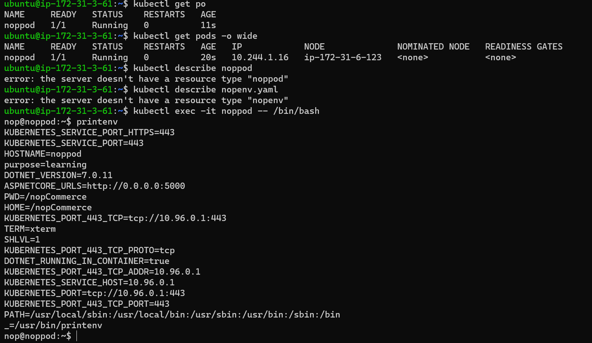

creating a pod with nop application(nop image is in dockerhub registry)

```yaml 
---
apiVersion: v1
kind: Pod
metadata:
  name: noppod
  labels:
    app: nop
    env: dev
spec:
  containers:
    - name: nopcon
      env:
        - name: purpose
          value: learning
      image: divyak123/spring:nop
      ports:
        - containerPort: 5000
          hostPort: 30001
          protocol: TCP

```