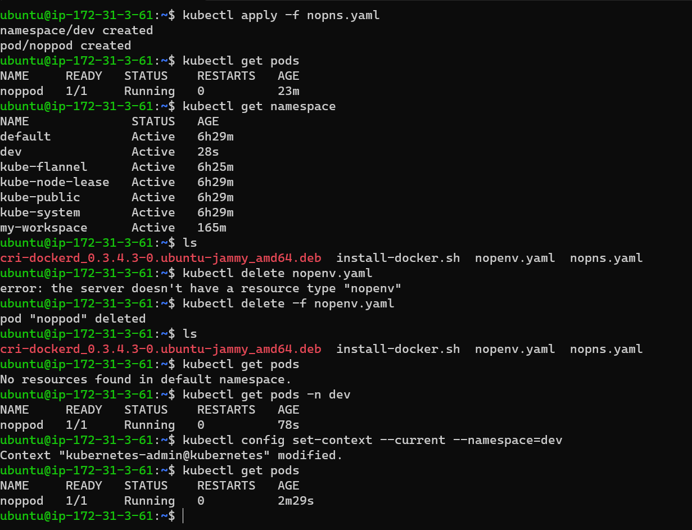

creating a namespace called dev for nopapplication.
need to write a manifest for namespace also that namespace will be created.
```yaml
---
apiVersion: v1
kind: Namespace
metadata: 
  name: dev

---
apiVersion: v1
kind: Pod
metadata:
  name: noppod
  namespace: dev
  labels:
    app: nop
    env: dev
spec:
  containers:
    - name: nopcon
      env:
        - name: purpose
          value: learning
      image: divyak123/spring:nop
      ports:
        - containerPort: 5000
          hostPort: 30001
          protocol: TCP
```

set context is created so that there is no need to type everytime namespace.
if you set context by default it will be  in that namespace. 